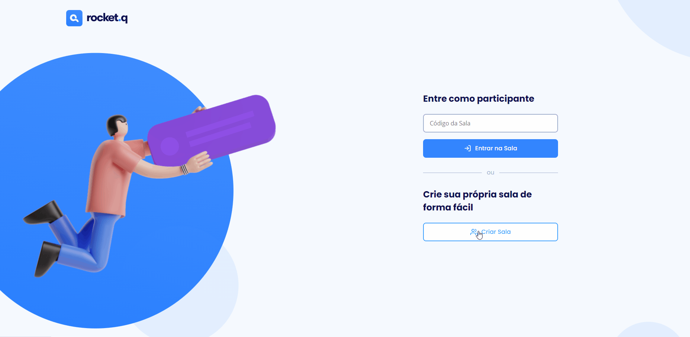
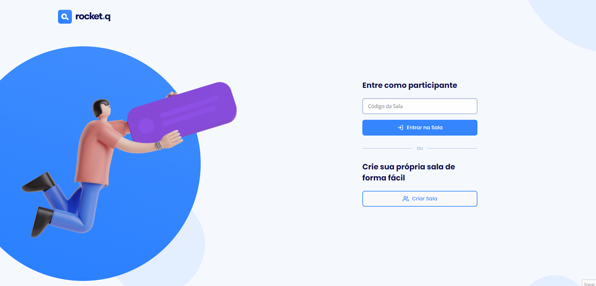

<H1>RocketQ</H1>

<p>RocketQ é um projeto de site para perguntas anônimas, o projeto funciona além do FrontEnd e BackEnd, onde você pode criar sua sala que tem seu próprio ID, para que você possa enviar para amigos e conhecidos, tudo sendo salvo em um banco de dados.

</br>
</br>
</br>
</br>


Ifoi construído em HTML, CSS e JS,
sendo utilizado o EJS para renderizar o FrontEnd e o NodeJS no BackEnd, o banco de dados foi utilizado o SQLite.</p>

</br>
</br>
</br>

```
# clonar o repositório

$ git clone https://github.com/YagoFontoura/rocketq.git

$ npm install //para instalar todas as dependências

$ npm start  // Para iniciar o projeto

#Acesse a porta: 3000
# localhost:3000
```

<p>Tecnologias usadas: HTML - CSS - JAVASCRIPT - NODEJS - EJS - SQLITE</p>

<p>Feito com 💜 por Yago B. Fontoura e RocketSeat 👋🏼 Veja meu <a href="https://www.linkedin.com/in/yago-fontoura/">Linkedin</a><p>
